# Table Data: A Comprehensive Guide to Fashion Style Categories

Fashion is an ever-evolving landscape, influenced by various factors such as cultural trends, social movements, and technological advancements. One way to make sense of this complexity is by categorizing different fashion styles into distinct categories. This table aims to provide a comprehensive guide to the numerous fashion style categories that exist, each with its unique characteristics, aesthetics, and connotations.

**Table: Fashion Style Categories**

| Fashion Style Category | Fashion Style | Description/Key Characteristics | Image |
| --- | --- | --- | --- |
|  | Romantic | (See Aesthetic/Mood - Romantic) |  |
|  | Rustic | Natural, earthy, and comfortable style, featuring natural fabrics (linen, cotton, wool), earthy tones, and a relaxed, unrefined aesthetic, often inspired by rural or country living. |  |
|  | Scene | (See Subcultures - Scene) |  |
|  | Scrumbro | A specific type of "bro" style, often associated with a slightly disheveled or "scruffy" look, still within the casual, sporty "bro" aesthetic. |  |
|  | Seapunk | Internet-based microgenre aesthetic, featuring 90s internet imagery, ocean themes, and a surreal, aquatic, and often vaporwave-adjacent style. |  |
|  | Skate/Skater | (See Subcultures - Skate/Skater) |  |
|  | Sloane Ranger | British upper-class style, classic and conservative, featuring tailored pieces, pearls, and a refined, traditional aesthetic. |  |
|  | Snowbro | A specific type of "bro" style associated with snowboarding and winter sports culture, featuring sporty, functional winter wear, and a relaxed, outdoorsy vibe. |  |
|  | Softboys | Contemporary style trend, featuring soft, pastel colors, oversized sweaters, and a gentle, sensitive, and often "artsy" aesthetic, contrasting with traditional masculinity. |  |
|  | Soulies | British youth subculture from the 1960s, associated with soul music, featuring sharp, stylish clothing, and a sophisticated, mod-influenced aesthetic. |  |
|  | Sporty | (See Lifestyle/Activity Based - Sporty) | 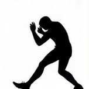 |
|  | Street | (See Lifestyle/Activity Based - Street) |  |
|  | Surf/Surfer Bro | (See Subcultures - Surf/Surfer (Californian)) and Bro (Bronies, Scrumbro, Snowbro, Surfer Bro, Tech Bro) |  |
|  | Tech Bro | (See Bro (Bronies, Scrumbro, Snowbro, Surfer Bro, Tech Bro)) |  |
|  | Techwear | (See Subcultures - Techwear) | 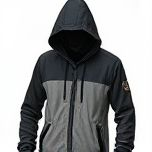 |
|  | Teddy Boys/Girls | (See Subcultures - Teddy Boys/Girls) | 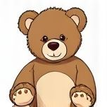 |
|  | Tomboy | Androgynous style for women, featuring traditionally masculine clothing, comfortable and practical pieces, and a rejection of overtly feminine styles, emphasizing comfort and functionality. | 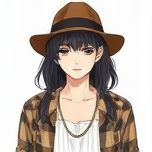 |
|  | Trendy | (See Other Categories - Trendy) | 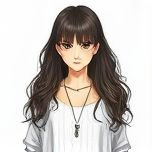 |
|  | Ulzzang | (See Subcultures - Ulzzang) |  |
|  | Urban | (See Lifestyle/Activity Based - Urban) | 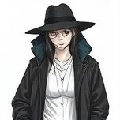 |
|  | Varsity | (See Other Categories - Varsity) | 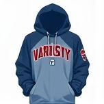 |
|  | Victorian | (See Other Categories - Victorian) | 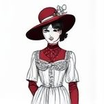 |
|  | Vintage | (See Other Categories - Retro/Vintage) |  |
|  | Western | (See Lifestyle/Activity Based - Country/Western/Cowboy) | 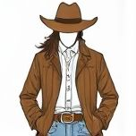 |
|  | Y2K | (See Decades - '00s (Y2K & Early 2000s)) | 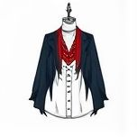 |
|  | Zoot Suiters | (See Other Categories - Zoot Suiters) | 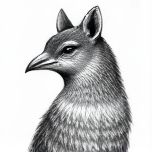 |

This table provides a comprehensive overview of the diverse fashion style categories that exist. Each category is characterized by its unique aesthetic, mood, and cultural context. By exploring these categories, one can gain a deeper understanding of the complex relationships between fashion, culture, and identity.

The table highlights the vast range of fashion styles, from romantic and rustic to scene and streetwear-inspired. It also showcases various subcultures, such as the bro culture, skate culture, and soulies. These categories are not mutually exclusive, and many individuals blend elements from multiple styles to create their unique look.

In conclusion, this table serves as a valuable resource for anyone interested in fashion, cultural studies, or identity formation. By recognizing the various fashion style categories, one can better appreciate the complexity of fashion's role in shaping our identities and interactions with others.

## Summary

This module covers key concepts related to this topic.