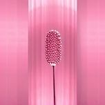
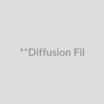
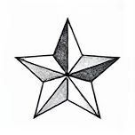
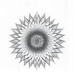

# Table Data: Create a Clear, Specific Title

As we delve into the world of lighting in photography, understanding the various types and effects of light can be a crucial aspect in capturing compelling images. In this module, we'll explore the different lighting styles, techniques, and terminology to help you better grasp the nuances of lighting.

When it comes to categorizing lighting types, photographers often group them into categories such as stylistic or effect-oriented lighting. These categories serve as a starting point for understanding how lighting can be used to convey specific moods, emotions, or messages in an image. Let's take a closer look at some of the most common lighting styles and their characteristics.

**Table: Lighting Types and Effects**

| **Lighting Type** | **Category** | **Description** | **Common Use/Effect** | Image |
| --- | --- | --- | --- | --- |
| **Hard Light** | Stylistic/Effect | Direct, undiffused light that creates strong, well-defined shadows and highlights, emphasizing texture and form. | Dramatic, edgy, emphasizes texture and form, high contrast; used for dramatic portraits, film noir styles, and creating a sense of tension or realism. |  |
| **High-Key Lighting** | Stylistic/Effect | Lighting style that aims to reduce the lighting ratio, meaning there is very little contrast between the bright and dark areas of the image. Often uses soft light sources. | Bright, optimistic, airy, low contrast; commonly used in comedies, sitcoms, and product advertising to create a cheerful and clean aesthetic. |  |
| **Low-Key Lighting** | Stylistic/Effect | Lighting style that uses strong contrasts between light and dark, with a dominant dark tone. Often uses hard light sources. | Dramatic, moody, mysterious, high contrast; commonly used in thrillers, horror, film noir, and to create suspense and drama. |  |
| **Cinematic Lighting** | Stylistic/Effect | A broad term encompassing lighting techniques used in filmmaking to create a visually appealing and emotionally resonant image. | Varies widely depending on the desired style and genre; often involves layering light, using motivated lighting, and creating depth and atmosphere. |  |
| **Dramatic Lighting** | Stylistic/Effect | Lighting designed to create a strong emotional impact, often using high contrast, shadows, and focused light sources. | Intense, emotional, powerful, emphasizes drama and tension; used in genres like drama, thriller, and horror to heighten emotional impact. |  |
| **Backlit** | Stylistic/Effect | Light source placed behind the subject, silhouetting the subject and separating it from the background. | Creates silhouette, halo effect, separates subject from background, adds depth; used for dramatic portraits, silhouettes, and highlighting hair or outlines. |  |
| **Rim Lighting** | Stylistic/Effect | Light that grazes the edge of the subject, creating a bright outline or "rim" that separates it from the background, often from the side or back. | Subtler than backlight, still defines edges and separates subject; adds dimension and shape, often used in portraits and to enhance three-dimensionality. |  |
| **Side Lighting** | Stylistic/Effect | Light source positioned to the side of the subject, creating shadows on one side and highlights on the other, emphasizing form and texture. | Sculptural, emphasizes form and texture, creates depth and dimension; versatile and commonly used in portraits, still life, and product photography. |  |
| **Silhouette Lighting** | Stylistic/Effect | Subject is unlit or very dimly lit from the front, appearing as a dark shape against a brightly lit background. |  |  |

## Summary

This module covers key concepts related to this topic.