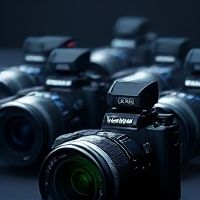

As we explore the world of camera technology, it's essential to understand the diverse range of camera types that cater to various needs and applications. In this module, we'll delve into the realm of action cameras, which have revolutionized the way we capture our most thrilling experiences. Action cameras are designed for rugged use, often featuring compact sizes, waterproof capabilities, and impressive video quality.

These cameras have become an essential tool for professionals and enthusiasts alike, offering a unique perspective on the world. Whether you're a thrill-seeking adventurer or a creative looking to push the boundaries of storytelling, action cameras provide a versatile platform for capturing life's most exciting moments.

### Table: Action Camera Categories

Here, we'll examine the different categories within the action camera landscape:

| **Camera Type Category** | **Specific Camera Type** | **Brand(s)** | **Representative Models** | **Key Features/Characteristics** | **Typical Uses** | Image |
| --- | --- | --- | --- | --- | --- | --- |
| Action Cameras | Rugged, Compact Video | GoPro, DJI, Insta360, Sony, AKASO, Campark | GoPro HERO series, DJI Osmo Action series, Insta360 ONE series, Sony RX0 series, AKASO EK series, Campark X series | Features: Ultra-compact and rugged, waterproof and shockproof, designed for action and extreme sports, wide-angle lenses, excellent video capabilities (4K, slow-motion), image stabilization, various mounting options, small sensors.   Range: Entry-level to professional action cameras, price depends on features and ruggedness. | Uses: Action sports (surfing, skiing, biking, motorsports), Underwater filming, Vlogging (action-oriented), POV footage, Adventure and outdoor activities, Situations requiring extreme durability and small size. |  |

As we examine this table, it's clear that action cameras are categorized based on their specific features and characteristics. The representative models listed demonstrate the range of options available within each category. For instance, the GoPro HERO series is a well-known brand offering high-quality video capabilities, while DJI's Osmo Action series excels in terms of stabilization and image quality.

The key features and characteristics highlighted in this table provide a comprehensive overview of what to expect from each camera type. From waterproofing and shockproofing to wide-angle lenses and slow-motion video, these cameras are designed for rugged use and can withstand extreme conditions. The typical uses listed illustrate the diverse range of applications for action cameras, from capturing breathtaking underwater footage to documenting adventure sports.

In conclusion, this table provides a valuable resource for anyone looking to understand the world of action cameras. By examining the categories, features, and typical uses outlined here, you'll gain a deeper appreciation for these versatile devices and their ability to capture life's most thrilling moments. Whether you're a seasoned professional or an enthusiastic beginner, this knowledge will empower you to make informed decisions when selecting the right camera for your needs.