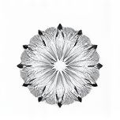

# Table Data: Understanding Filters for Your Lens

In this module, we will delve into the world of filters, exploring various types that can enhance your photography experience. A filter is a simple yet powerful tool that can significantly impact the look and quality of your images. By understanding what each type does and how to use them effectively, you'll be able to unlock new creative possibilities and take your photography skills to the next level.

One of the most crucial aspects of photography is controlling the light entering the lens. This is where filters come in – a thin layer of glass or plastic that can modify the light before it reaches your sensor. By filtering out specific wavelengths, polarizing light, or reducing intensity, you can achieve unique effects and create stunning images.

In this module, we will examine five categories of filters: Protection, Exposure/Density Control, Glare & Reflection Control, Color Enhancement, and Special Effects. Each category has its own set of filters designed to address specific needs in various photography situations.

**Filter Categories**

Here is a comprehensive table highlighting the different filter types:

| Filter Type | Category | Description | Common Use/Effect | Image |
| --- | --- | --- | --- | --- |
| Protective Filters | Protection | Primarily used to protect the front element of the lens from physical damage, dust, and scratches. |  |  |
| UV Filter | Protection | Originally designed to block ultraviolet (UV) light, but modern lenses often have UV coatings. Primarily used for physical lens protection. | Lens protection from scratches, dust, and fingerprints; minimal effect on image quality; can reduce haze in some (older) lenses but less crucial with modern coatings. |  |
| Clear/Haze Filter | Protection | Optically clear glass filter with no color or effect, purely for lens protection. Some may have slight haze reduction properties. | Purely for lens protection; no impact on color or exposure; ideal for always-on protection without altering image characteristics. |  |
| Light Modification Filters | Exposure/Density Control | Filters designed to control the amount of light entering the lens, affecting exposure and depth of field. |  |  |
| Neutral Density (ND) Filter | Exposure/Density Control | Reduces the intensity of light across all wavelengths equally, allowing for longer exposures or wider apertures in bright conditions. | Shooting with wide apertures in bright sunlight (shallow depth of field), long exposure photography (motion blur), reducing brightness for video shooting at desired shutter speeds. |  |
| Graduated ND Filter | Exposure/Density Control | ND filter that is dark on one half and clear on the other, with a gradual transition in between. | Balancing exposure between bright skies and darker foregrounds in landscape photography; controlling dynamic range in scenes with uneven lighting. |  |
| Variable ND Filter | Exposure/Density Control | Adjustable ND filter achieved by rotating a ring, allowing for a range of ND strengths in a single filter. | Quickly adjusting ND strength without changing filters; convenient for video shooting in changing light conditions; can sometimes cause uneven density or cross-polarization. |  |
| Polarizing Filters | Glare & Reflection Control, Color Enhancement | Filters that reduce glare and reflections from non-metallic surfaces and enhance color saturation, especially in skies and foliage. |  |  |
| Circular Polarizer (CPL) | Glare & Reflection Control, Color Enhancement | Reduces glare and reflections from water, glass, and other non-metallic surfaces; deepens blue skies and enhances color saturation. | Reducing glare and reflections in landscape and outdoor photography; enhancing sky and foliage colors; improving contrast and clarity; essential for shooting water and glass. |  |
| Linear Polarizer (PL) | Glare & Reflection Control, Color Enhancement | Older type of polarizer, similar effect to CPL but can interfere with autofocus and metering systems in some cameras. | Primarily for older manual focus cameras or specific scientific/technical applications where linear polarization is required; generally CPL is preferred for most photography. |  |

In conclusion, understanding filters is a crucial aspect of photography. By exploring the different types of filters and their effects, you can enhance your creative control and produce stunning images that capture the world's beauty. Whether you're looking to protect your lens, modify exposure, or reduce glare, there is a filter category for every photography situation.

## Summary

This module covers key concepts related to this topic.